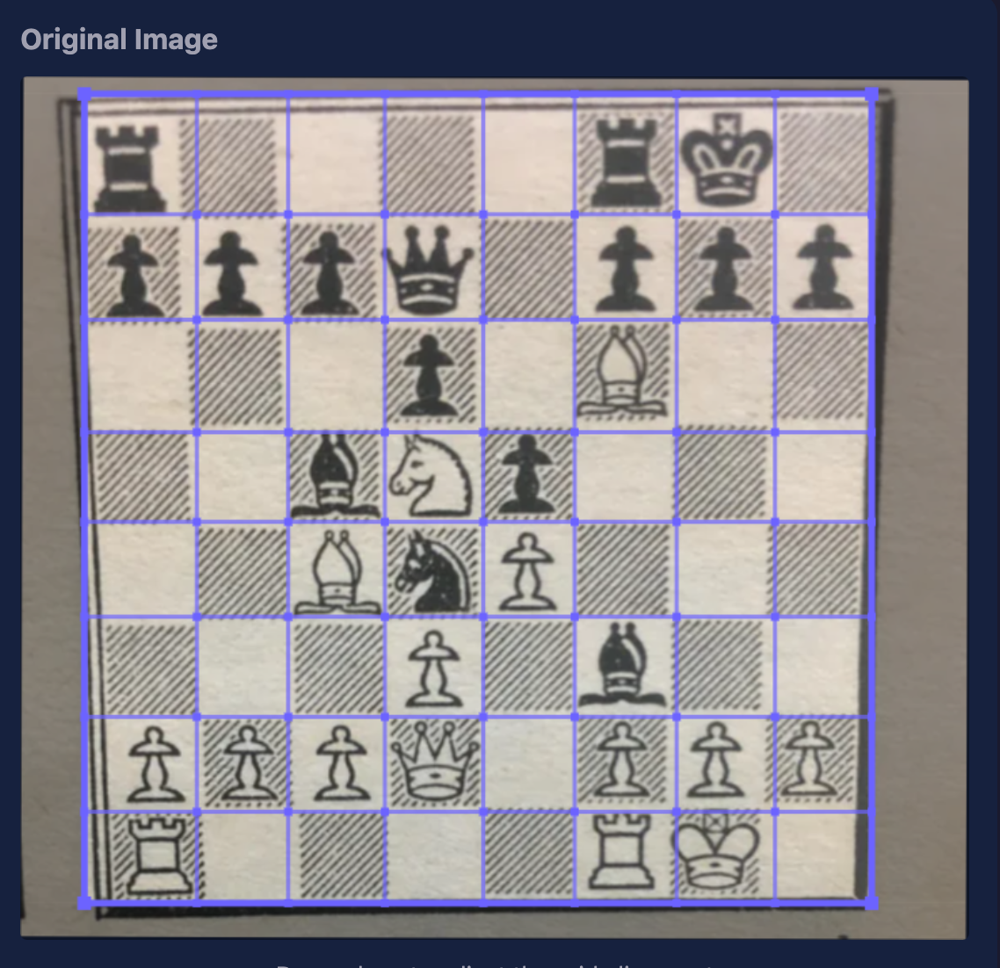

# Chess Image to FEN

Convert chess board screenshots into FEN notation directly in your browser.

**Live demo: [https://mglass222.github.io/Chess-Image-to-FEN/](https://mglass222.github.io/Chess-Image-to-FEN/)**

## Features

- Drag & drop, file upload, or paste from clipboard
- Works with chess.com, lichess, and other digital board screenshots
- Also works with photos of physical chess boards (books, newspapers, OTB games)
- Runs entirely in the browser (no server required)
- Auto-detects board orientation (white/black on bottom)
- Manual grid adjustment — drag corners and gridlines to fine-tune board detection
- One-click copy FEN or open in Lichess analysis

## How It Works

1. **Board Detection** — Finds the chessboard region using chessboard pattern scoring, then refines to pixel accuracy with gradient-based grid line alignment
2. **Manual Grid Adjustment** — If auto-detection isn't perfect, you can drag the corner handles and individual gridlines to align them with the board. This is especially useful for photos of from books taken at an angle.

   

3. **Piece Classification** — MobileNetV2 neural network (ONNX Runtime Web) classifies each of the 64 squares into one of 13 classes (empty + 12 piece types)
4. **FEN Assembly** — Predictions are assembled into a FEN string with auto-detected orientation

## Training

The model was trained on synthetic data generated from 40 lichess piece sets rendered across 10 board color themes. See [BOARD_DETECTION_NOTES.txt](BOARD_DETECTION_NOTES.txt) for detailed implementation notes.

## Running Locally

```bash
cd docs
python -m http.server 8080
```

Open [http://localhost:8080](http://localhost:8080)
